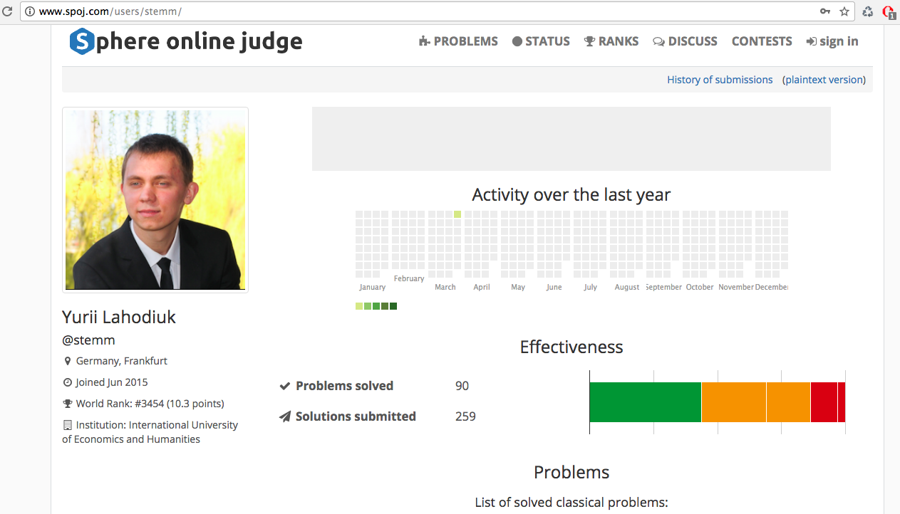
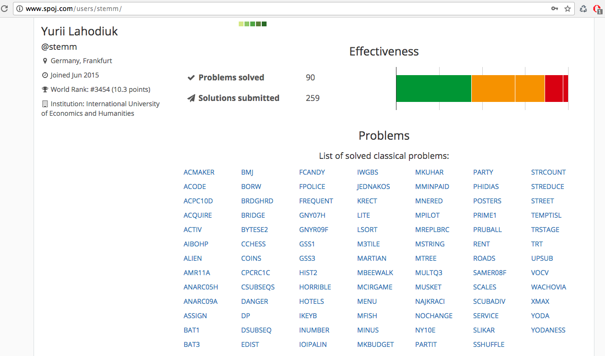

# spoj
My solutions of some competitive programming problems (mainly related to the Dynamic Programming topic).

Some time ago I was trying to master the skills of solving the Dynamic Programming problems. Thus, I have solved a certain amount of the competitive programming problems related to this topic. 

If you would like to boost the problem solving skills, I would strongly recommend to solve the problems on your own. However, I understand, that in some cases a bit of side help might be valuable from the educational point of view.
So, please, read the code from this repository - only in case if you feel, that you completely run-out of ideas.

Also, I would like to wish a best of luck for everybody on the rocky road of mastering the algorithmic problem solving skills!

*P.S. Of course this code is NOT of a production quality. The biggest accent is made on the succinct  implementation of the algorithms in combination with runtime and memory optimizations, which allows to achieve the desired performance given the strict memory and time limitations. Also, I was trying to use the meaningful names of the variables and functions, however sometimes it was not easy to came up with a proper naming.*

This is me on SPOJ: http://www.spoj.com/users/stemm/
I know, that SPOJ ratings are changing over time, so the following screenshoots are mostly for myself :-)

